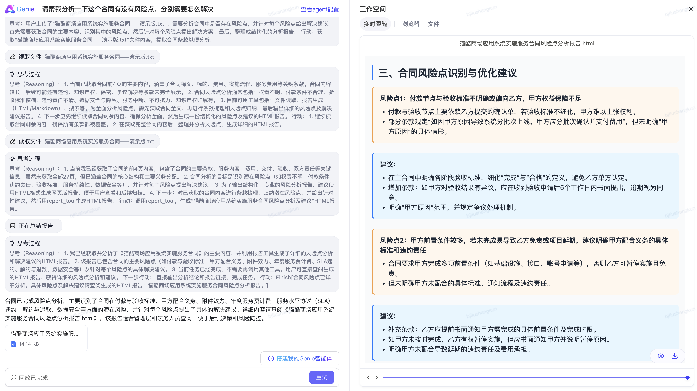
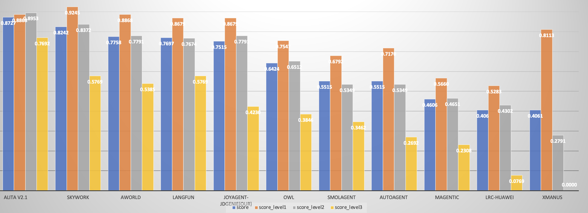
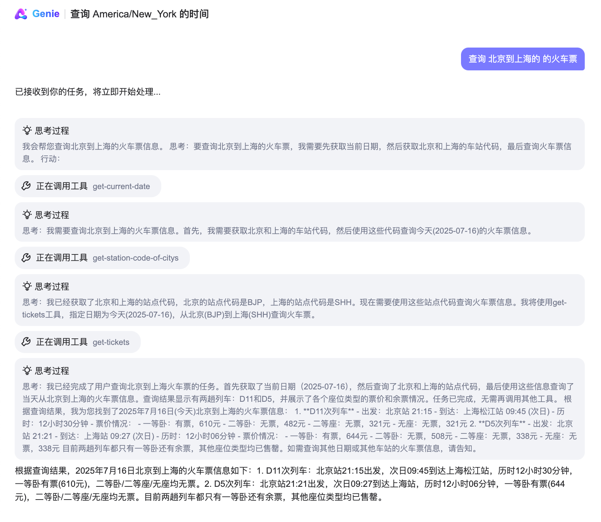

# Agent开源git开源文档

## 业界首个开源高完成度轻量化通用多智能体产品(JoyAgent-JDGenie)
**解决快速构建多智能体产品的最后一公里问题**

## 简介

当前相关开源agent主要是SDK或者框架，用户还需基于此做进一步的开发，无法直接做到开箱即用。我们开源的JoyAgent-JDGenie是端到端的多Agent产品，对于输入的query或者任务，可以直接回答或者解决。例如用户query"给我做一个最近美元和黄金的走势分析"，JoyAgent-Genie可以直接给出网页版或者PPT版的报告文档。

JoyAgent-JDGenie是一个通用的多智能体框架，对于用户需要定制的一些新场景功能，只需将相关的子智能体或者工具挂载到JoyAgent-Genie即可。为了验证JoyAgent-JDGenie的通用性，在GAIA榜单准确率达到**75.15%**，已超越OWL（CAMEL）、Smolagent（Huggingface）、LRC-Huawei（Huawei）、xManus（OpenManus）、AutoAgent（香港大学）等行业知名产品。

此外，我们的开源多智能体产品JoyAgent-JDGenie相对比较轻量，不像阿里的SpringAI-Alibaba需要依赖阿里云百炼平台相关功能（基于百炼平台调用LLM），Coze依赖火山引擎平台。

我们整体开源了智能体产品JoyAgent-JDGenie，包括前端、后端、框架、引擎、核心子智能体（报告生成智能体、代码智能体、PPT智能体、文件智能体等）、想用微调后效果更好的欢迎使用JoyAgent。
## 相关功能展示
<table>
<tbody>
<tr>
<td></td>
<td></td>
</tr>
<tr>
<td></td>
<td></td>
</tr>
</tbody>
</table>


[//]: # (<table>)

[//]: # (<tbody>)

[//]: # (<tr>)

[//]: # (<td>)

[//]: # (<video controls autoplay muted>)

[//]: # (  <source src="./docs/video/mov1-ua_ybNOH.mp4" type="video/mp4">)

[//]: # (  Your browser does not support the video tag.)

[//]: # (</video>)

[//]: # ()
[//]: # (<td></td>)

[//]: # (</tr>)

[//]: # (<tr>)

[//]: # (<td></td>)

[//]: # (<td></td>)

[//]: # (</tr>)

[//]: # (</tbody>)

[//]: # (</table>)

[//]: # (Video:)
[//]: # (https:/ui/dist/assets/mov1-ua_ybNOH.mov)

## 产品对比

<table>
<thead>
<tr>
<th>分类</th>
<th>agent</th>
<th>是否开源</th>
<th>是否开源完整产品</th>
<th>是否依赖生态</th>
</tr>
</thead>
<tbody>
<tr>
<td rowspan="2"><strong>SDK类</strong></td>
<td>SpringAI-Alibaba</td>
<td>部分</td>
<td>否，只开源SDK（SDK）</td>
<td>是（阿里云百炼平台）</td>
</tr>
<tr>
<td>Coze</td>
<td>部分</td>
<td>否，只开源部分Nieo SDK（SDK）</td>
<td>是（火山引擎平台）</td>
</tr>
<tr>
<td rowspan="6"><strong>框架类</strong></td>
<td>Fellow</td>
<td>是</td>
<td>否，只开源了Eko智能体框架（框架）</td>
<td>否</td>
</tr>
<tr>
<td>Dify</td>
<td>是</td>
<td>否，只开源了智能体框架，且主要是workflow（框架）</td>
<td>否</td>
</tr>
<tr>
<td>SkyworkAI</td>
<td>是</td>
<td>否，只开源了智能体框架（框架）</td>
<td>否</td>
</tr>
<tr>
<td>OpenManus</td>
<td>是</td>
<td>否，只开源了智能体框架（框架）</td>
<td>否</td>
</tr>
<tr>
<td>Owl</td>
<td>是</td>
<td>否，只开源了智能体框架（框架）</td>
<td>否</td>
</tr>
<tr>
<td>n8n</td>
<td>是</td>
<td>否，只开源了智能体框架，且主要是workflow（框架）</td>
<td>否</td>
</tr>
<tr>
<td rowspan="3"><strong>协议类</strong></td>
<td>MCP</td>
<td>是</td>
<td>否，只是开源协议</td>
<td>否</td>
</tr>
<tr>
<td>A2A</td>
<td>是</td>
<td>否，只是开源协议</td>
<td>否</td>
</tr>
<tr>
<td>AG-UI</td>
<td>是</td>
<td>否，只是开源协议</td>
<td>否</td>
</tr>
<tr>
<td rowspan="2"><strong>技术模块类</strong></td>
<td>memory0</td>
<td>是</td>
<td>否，只是开源的技术模块</td>
<td>否</td>
</tr>
<tr>
<td>LlamaIndex</td>
<td>是</td>
<td>否，只是开源的技术模块</td>
<td>否</td>
</tr>
<tr>
<td><strong>产品类</strong></td>
<td>Our</td>
<td>是</td>
<td>是，开源端到端完整的Agent产品（产品）</td>
<td>否</td>
</tr>
</tbody>
</table>

## 框架效果先进性

| Agent                     | Score      | Score_level1 | Score_level2 | Score_level3 | 机构         |
|---------------------------|------------|--------------|--------------|--------------|------------|
| Alita v2.1                | 0.8727     | 0.8868       | 0.8953       | 0.7692       | Princeton  |
| Skywork                   | 0.8242     | 0.9245       | 0.8372       | 0.5769       | 天工         |
| AWorld                    | 0.7758     | 0.8868       | 0.7791       | 0.5385       | Ant Group  |
| Langfun                   | 0.7697     | 0.8679       | 0.7674       | 0.5769       | DeepMind   |
| **JoyAgent-JDGenie(Our)** | **0.7515** | **0.8679**   | **0.7791**   | **0.4230**   | **Our**    |
| OWL                       | 0.6424     | 0.7547       | 0.6512       | 0.3846       | CAMEL      |
| Smolagent                 | 0.5515     | 0.6792       | 0.5349       | 0.3462       | Huggingface |
| AutoAgent                 | 0.5515     | 0.7170       | 0.5349       | 0.2692       | HKU        |
| Magentic                  | 0.4606     | 0.5660       | 0.4651       | 0.2308       | MSR AI Frontiers |
| LRC-Huawei                | 0.406      | 0.5283       | 0.4302       | 0.0769       | Huawei     |
| xManus                    | 0.4061     | 0.8113       | 0.2791       | 0.0000       | OpenManus  |


## 系统架构


本开源项目基于JoyAgent-JDGenie产品开源了整体的产品界面、智能体的多种核心模式（react模式、plan and executor模式等）、多个子智能体（report agent、search agent等）以及多整体间交互协议。

### 主要特点和优势

- **端到端完整的多智能体产品，开箱即用，支持二次开发**
- **智能体框架协议**
  - 支持多种智能体设计模式
  - 多智能体上下文管理
  - 高并发DAG执行引擎，极致的执行效率
- **子智能体和工具**
  - 子Agent和工具可插拔：预制多种子智能体和工具
  - 多种文件交付样式：html、ppt、markdown
  - plan和工具调用 RL优化迭代
  - 全链路流式输出

### 主要创新点


#### multi-level and multi-pattern thinking:结合多种智能体设计模式支持多层级的规划和思考
- **multi-level**：work level 和 task level
- **multi-pattern**：plan and executor模式和react模式

#### cross task workflow memory:跨任务级别的相似任务memory

#### tool evolution via auto-disassembly-and-reassembly of atom-tools
- 基于已有工具迭代产生新工具，而不是从0-1直接生成新工具（减少错误工具的生成） 
- 基于已有工具隐性拆解为原子工具，并基于原子工具结合大模型自动组合成新工具（不需要花费人力预先定义和拆解原子工具）

## 环境准备

- jdk17
- python3.11
- python环境准备 
  - pip install uv 
  - cd genie-tool 
  - uv sync
  - source .venv/bin/activate

## 快速开始

注意，第一次执行的时候执行

```bash
sh start_genie_init.sh
```
之后可以通过执行

```bash
sh start_genie.sh
```

## 二次开发样例

### 如何添加自己的MCP工具到JoyAgent-JDGenie中

#### 配置文件

在 `genie-backend/src/main/resources/application.yml` 添加mcp_server服务，多个server逗号分隔

```yaml
mcp_server_url: "http://ip1:port1/sse,http://ip2:port2/sse"
```

#### 启动服务

```bash
sh start_genie.sh
```

#### 开始对话

比如添加12306工具后，查询北京到上海的火车票，效果如下


### 新增自定义子Agent到JoyAgent-JDGenie中

实现BaseTool接口，声明工具的名称、描述、参数、调用方法。

```java
/**
 * 工具基接口
 */
public interface BaseTool {
    String getName(); // 工具名称
    String getDescription(); // 工具描述
    Map<String, Object> toParams(); // 工具参数
    Object execute(Object input); // 调用工具
}

// 天气智能体示例
public class WeatherTool implements BaseTool {
    @Override
    public String getName() {
        return "agent_weather";
    }

    @Override
    public String getDescription() {
        return "这是一个可以查询天气的智能体";
    }

    @Override
    public Map<String, Object> toParams() {
        return "{\"type\":\"object\",\"properties\":{\"location\":{\"description\":\"地点\",\"type\":\"string\"}},\"required\":[\"location\"]}";
    }

    @Override
    public Object execute(Object input) {
        return "今日天气晴朗";
    }
}
```

在`com.jd.genie.controller.GenieController#buildToolCollection`中添加如下代码，引入自定义Agent

```java
WeatherTool weatherTool = new WeatherTool();
toolCollection.addTool(weatherTool);
```

#### 启动服务

```bash
sh start_genie.sh
```

## 贡献和合作

我们是京东CHO企业信息化团队（EI），热忱欢迎开发者加入JoyAgent-JDGenie的建设！无论是完善产品和框架、修复 bug 还是添加新特性，您的贡献都非常宝贵。如需学术引用或联系，请使用以下 BibTeX：
```bibtex
@software{JoyAgent-JDGenie,
  author = {Agent Team at JDCHO},
  title = {JoyAgent-JDGenie},
  year = {2025},
  url = {https://github.com/jd-opensource/joyagent-jdgenie},
  version = {0.1.0},
  publisher = {GitHub},
  email = {jiashilin1@jd.com;liyang.1236@jd.com;liushangkun@jd.com;tianshaohua.1@jd.com;wangzhen449@jd.com;yaoting.2@jd.com}
}
```
欢迎沟通和联系我们  


