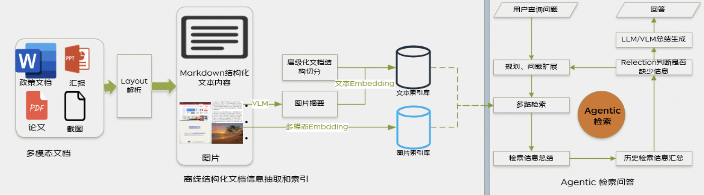
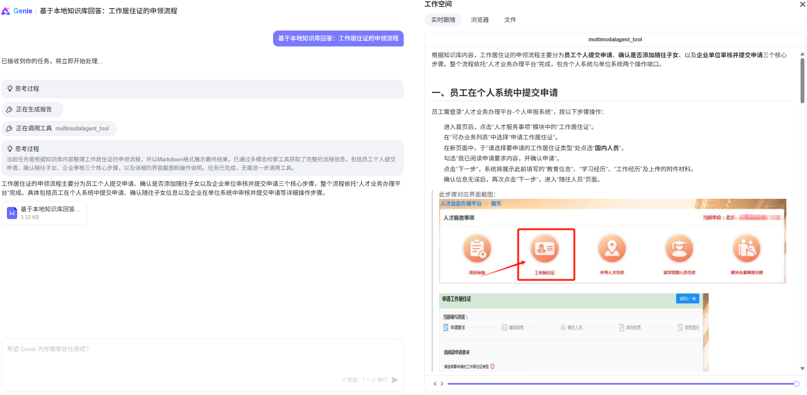
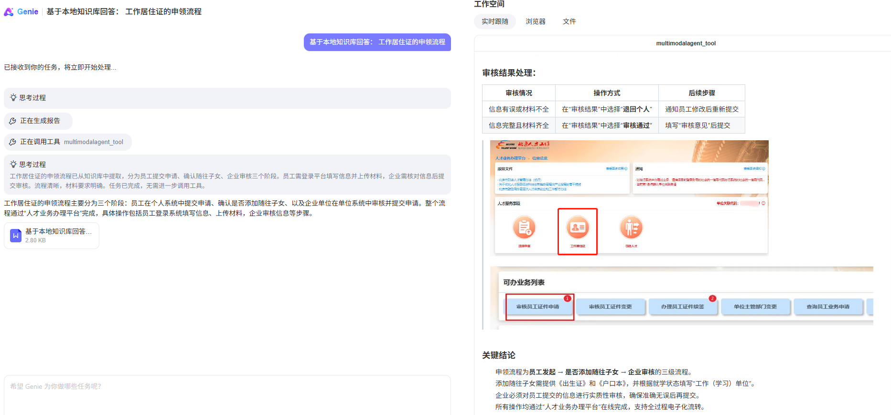
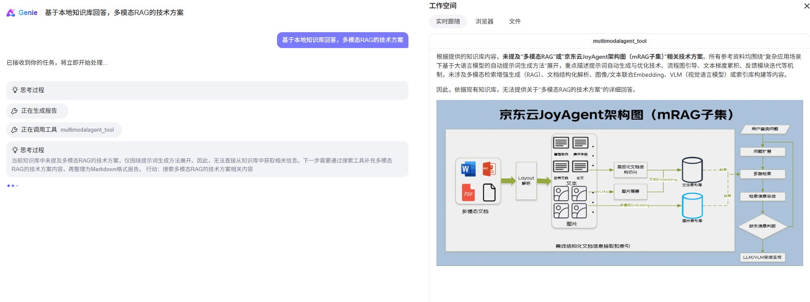
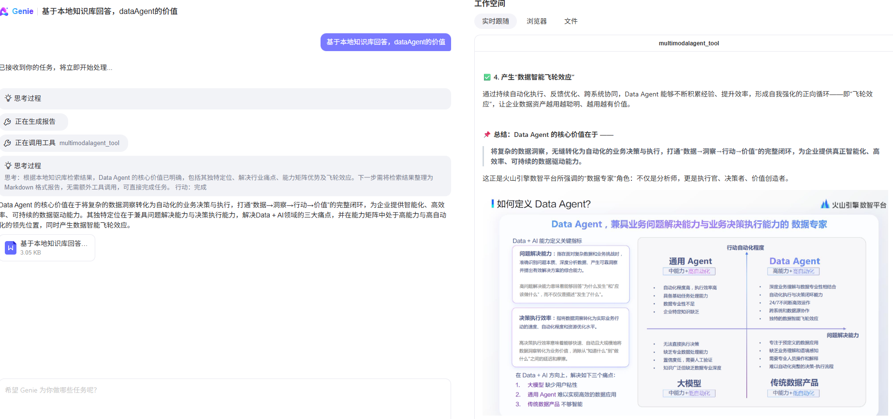

# 多模态知识库管理

## 简介
**多模态知识管理** 

多模态知识管理是一款面向多模态文档的综合性RAG平台，能够高效解析和查询多种内容形态的复杂文档，为复杂文档的智能问答与内容生成提供一站式解决方案。



🎯 **核心特性**

- **🔄 端到端多模态智能管道**：打造从原始数据解析到跨模态语义检索与智能生成的全链路处理体系，实现多源异构内容的深度融合与协同。
- **📑 全场景文档兼容性**：原生支持PDF、Office套件、图片等主流格式，自动识别并抽取复杂结构与多模态信息，重构统一知识视图。
- **🔗 结构化信息抽取引擎**：集成MinerU解析框架，实现文档结构的深度识别与多模态内容的精确提取，确保数据要素的高度还原与可靠性。
- **⚡ 架构高度解耦与可扩展性**：实现解析、嵌入、检索、生成等核心模块的灵活拆分与组合，满足企业级多样化场景与定制需求。
- **🔍 多策略融合检索体系**：创新性集成关键词、向量、知识图谱等多重检索技术，实现跨模态内容的高效定位与深度关联。
- **🌐 标准 API + Web UI**：提供可视化操作界面与标准API，支持本地化及私有云部署，全面守护数据自主权与隐私安全。

## 案例展示

|  |  |
| :---: | :---: |
|  <br>  |  <br>  |

## 部署使用指南
**注意: 请移步至mrag分支**

📺 [部署使用指南视频](https://www.bilibili.com/video/BV1EBUYBjEmX )

## 效果先进性：DoubleBench数据集测评

在公开数据集DoubleBench上，我们对比测评了MDocAgent、Colqwen-gen、ViDoRAG、M3DOCRAG等多模态问答系统。

最终答案的准确性采用LLM作为评判标准进行评估（https://arxiv.org/abs/2306.05685）
。 GPT-4o根据0到10的等级对生成的答案与真实答案的正确性进行评分。得分不低于7分的答案为正确，不高于3分的答案为错误，其余答案为部分正确。

测评结果如下：**JoyAgent的正确率达到76.2%,优于当前其他多模态问答系统。**

| 系统           | 正确✅       | 部分正确❓ | 错误❌ |
|--------------|-----------|-----------|-------|
| **JoyAgent** | **0.762** | 0.105     | 0.133 |
| MDocAgent    | 0.757     | 0.132     | 0.111 |
| Colqwen-gen  | 0.676     | 0.160     | 0.164 |
| ViDoRAG      | 0.623     | 0.144     | 0.233 |
| M3DOCRAG     | 0.538     | 0.138     | 0.324 |

- MDocAgent： 北卡罗来纳大学-2025年（https://arxiv.org/abs/2503.13964）

- ViDoRAG：阿里巴巴NLP实验室-2025年（https://arxiv.org/abs/2502.18017）

- M3DOCRAG：北卡罗来纳大学-2025年（https://arxiv.org/abs/2411.04952）

- Colqwen-gen：参照组，结果由gpt-4o直接回复生成（不采用RAG）。

## 相关配置
具体见JoyAgent首页的配置说明


## 项目共建者
贡献者：Liu Shangkun,[Li Yang](https://scholar.google.com.hk/citations?hl=zh-CN&user=AeCTbv8AAAAJ&view_op=list_works&gmla=AH8HC4zYqeayQxrQFmScZ7XYxLah1enc8ynhQYMtBdPmjwfpMBvsTj_OoBkFTPCw1Xi2xk7gbTzHPH-QpJSw_sGkCKdYDVXSu8Ty2tNJMhs),Jia Shilin,Tian Shaohua,Wang Zhen,Yao Ting,Wang Hongtao,Zhou Xiaoqing,Liu min,Zhang Shuang,Liuwen,Yangdong,Xu Jialei,Zhou Meilei,Zhao Tingchong,Wu jiaxing, Wang Hanmin, Zhou Zhiyuan, Xu Shiyue,Liu Jiarun, Hou Kang, Jing Lingtuan, Guo Hongliang, Liu Yanchen, Chen Kun, Pan Zheyi, Duan Zhewen, Tu Shengkun, Zhang Haidong, Wang Heng, Zhang Junbo, Liu haibo, Song Li, Zhang Meng

所属机构:京东CHO企业信息化团队（EI）、京东科技协同办公团队、京东物流

## 贡献和合作

我们欢迎所有好想法和建议，如果您想成为项目的共建者，可随时向我们提Pull Request。无论是完善产品和框架、修复bug还是添加新特性，您的贡献都非常宝贵。
在此之前需要您阅读并签署贡献者协议并发送到邮箱org.developer3@jd.com，请阅读 [贡献指南中文版](https://github.com/jd-opensource/joyagent-jdgenie/blob/main/contributor_ZH.pdf)，[贡献指南英文版](https://github.com/jd-opensource/joyagent-jdgenie/blob/main/contributor_EN.pdf)


## 引用

如需学术引用，请使用以下 BibTeX：
```bibtex
@software{JoyAgent-JDGenie,
  author = {Agent Team at JDCHO},
  title = {JoyAgent-JDGenie},
  year = {2025},
  url = {https://github.com/jd-opensource/joyagent-jdgenie},
  version = {0.1.0},
  publisher = {GitHub},
  email = {liuhaibo6@jd.com;jiashilin1@jd.com;liyang.1236@jd.com;liushangkun@jd.com;tianshaohua.1@jd.com;wangzhen449@jd.com;yaoting.2@jd.com;houkang6@jd.com;jinglingtuan@jd.com;guohongliang@jd.com}
}
```

## Contributors

<a href="https://github.com/jd-opensource/joyagent-jdgenie/graphs/contributors">
  
</a>

# Star History
[](https://star-history.com/#jd-opensource/joyagent-jdgenie&Date)

欢迎沟通和联系我们  


[//]: # (![contact]&#40;./docs/img/contact.jpg&#41;)
